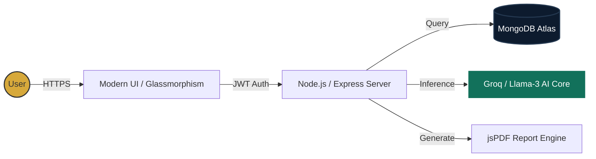

# 📊 Automated Tax Filing Guide
> **The Intelligent Tax Planning Suite for the Modern Indian Taxpayer.**

[](https://automated-tax-filing-guide-6dzo.onrender.com)
[](https://github.com/Pratik9008/Automated-Tax-Filing-Guide)
[](https://opensource.org/licenses/MIT)

---

## 📽️ Executive Summary
Navigating the Indian tax system is notoriously complex. With the introduction of the New Regime and various deduction limits (80C, 80D, 80TTA), taxpayers often struggle to choose the most efficient path. 

**Automated Tax Filing Guide** is a full-stack SaaS solution designed to eliminate this confusion. Using real-time calculation engines and AI-driven advisory, it empowers users to optimize their taxes in seconds, not hours.

---

## 🚀 Key Value Propositions

| ⚡ Intelligent Dashboard | 🤖 AI Tax Advisor | 📑 PDF Reporting |
| :--- | :--- | :--- |
| Real-time visualization of Income vs. Tax Liability. | Personalized CA-verified tax saving tips using Groq/Llama-3. | Generate professional, presentation-ready reports instantly. |

---

## 🏗️ System Architecture & Data Flow



---

## 💻 Tech Stack

- **Frontend:** Vanilla JS (ES6+), CSS3 (Modern Flex/Grid), Chart.js (Data Visualization)
- **Backend:** Node.js, Express.js (RESTful Architecture)
- **Database:** MongoDB Atlas (Cloud NoSQL)
- **Intelligence:** Groq Cloud API (Llama-3.3-70B model)
- **Security:** JWT (JSON Web Tokens), Bcrypt (Password Hashing)
- **Deployment:** Render (Automated CI/CD)

---

## 🌟 Advanced Features

- **Dynamic Regime Comparison:** Instant math-based recommendation between Old vs. New Regime (FY 2024-25).
- **Automated Deduction Limits:** Built-in validation for statutory limits (e.g., ₹1.5L for 80C, ₹25k for 80D).
- **Live AI Support:** An "Intercom-style" chat interface for tax queries.
- **Premium UX:** Fully responsive dark/light mode with sleek glassmorphism panels.

---

## 🛠️ Installation & Deployment

### Local Development
```bash
# Clone the repository
git clone https://github.com/Pratik9008/Automated-Tax-Filing-Guide.git

# Install dependencies
npm install

# Start the development server
npm run dev
```

### Environment Variables
Create a `.env` file in the `backend/` directory:
```env
MONGO_URI=your_mongodb_connection_string
JWT_SECRET=your_secure_random_key
GROQ_API_KEY=your_groq_api_key
```

---

## 🤝 Project Leadership
- **Pratik** - *Lead Architect & Full Stack Developer*

---
> **Disclaimer:** This tool provides estimates based on current Indian Tax Laws. Always consult a certified professional for final filings. 
> *Academic Project | 2024*
