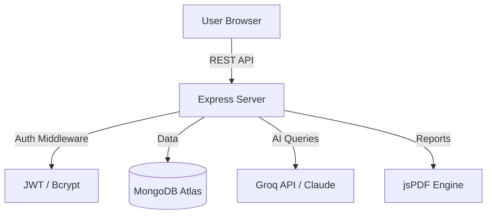

# 📊 Automated Tax Filing Guide
> **Smart Tax Planning for the Modern Indian Taxpayer**

[](https://nodejs.org/)
[](https://www.mongodb.com/)
[](https://groq.com/)
[](LICENSE)

---

## 📽️ Project Presentation Overview

This project was built to simplify the complex world of Indian Income Tax. Instead of juggling spreadsheets, users can manage their entire tax profile in one secure dashboard.

### 🌟 Why this project?
- **Problem:** Many taxpayers are confused between the Old and New regimes.
- **Solution:** A data-driven comparison engine with AI-backed guidance.

---

## 🧠 System Architecture



---

## 🛠️ Core Features

| Feature | Description |
| :--- | :--- |
| **Regime Logic** | Updated for FY 2024-25 (New Regime Standard Deduction: ₹75k) |
| **Deduction Engine** | Handles 80C, 80D, 80TTA, HRA, and Home Loan Interest |
| **AI Insights** | Personalized advice based on your actual income data |
| **PDF Generation** | One-click export of your financial summary |
| **Dark Mode** | Premium glassmorphism UI with eye-friendly theme switching |

---

## 🚀 Technical Setup

### Prerequisites
- Node.js (v18+)
- MongoDB Atlas Account
- Groq API Key

### Quick Start
1. **Clone & Install**
   ```bash
   git clone https://github.com/YOUR_USERNAME/Automated-Tax-Filing-Guide.git
   npm install
   ```
2. **Environment Config** (`backend/.env`)
   ```env
   MONGO_URI=mongodb+srv://...
   JWT_SECRET=supersecret
   GROQ_API_KEY=gsk_...
   ```
3. **Run Dev Mode**
   ```bash
   npm run dev
   ```

---

## 🤝 Contributors
- **Pratik** - *Full Stack Developer & Architect*

---
*Generated for Academic Presentation | 2024*
